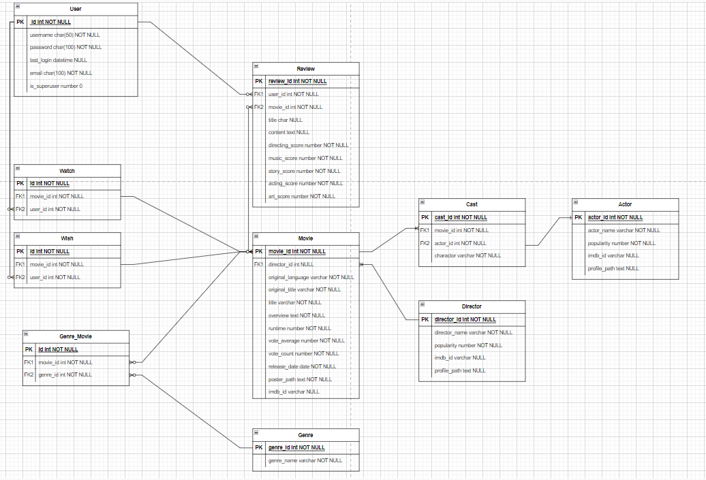

## SSAF챠피디아

영화 정보 제공, 추천 및 리뷰 작성 프로젝트

영화와 배우들의의 정보를 제공하는 프로젝트이며 기본적으로 리뷰 및 평가를 내릴 수 있도록 설정하였습니다.

가장 많이 영감을 받았던 웹사이트로는 키노라이트가 있습니다. 키노라이트의 깔끔하고 직관적인 UI도 UI이지만, 영화 상세 페이지에 들어갔을 때 해당 영화에 관련된 배우, 카드 뉴스, 평점 및 리뷰들을 한 눈에 볼 수 있었다는 점에서 저희가 바라는 목표를 찾았다고 생각했습니다.

그 점을 제외하고, 어떠한 추천 알고리즘을 적용해야 다른 서비스들과의 차별점을 둘 수 있을까에 대해서도 많은 얘기가 오고갔습니다.

주어진 시간을 거의 다 쓰고도 알고리즘을 결정하지 못해 결국 종료일 전날에야 타협안을 찾고 알고리즘을 작성했습니다.

사용자가 리뷰를 남기면 영화를 봤다라고 판단하여 해당 영화의 장르를 파악한 뒤, 그 장르의 영화들을 추천해주는 방식입니다.

### Requirements

#### 프론트엔드

* Vue.js, vuex, vue-router, vuetify, vue-chartjs, vue-infinite-loading
* vue-slick-carousel
* lodash, axios 

#### 백엔드

* Django

#### DB

* sqlite3

### 프로젝트 구조

### 주요 기능

#### API 

* tmdb: 영화의 포스터나 제목, 개요 등의 정보를 받아오기 위해 사용하였습니다.

#### VUE

* vue-slick-carousel: 페이지 양쪽에 화살표 버튼을 만들고 자연스럽게 페이지가 이동하도록 하기 위해 사용하였습니다.

### 추천 알고리즘

