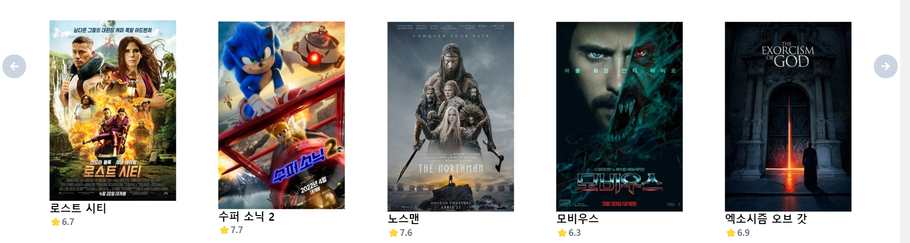

## SSAF챠피디아

영화 정보 제공, 추천 및 리뷰 작성 프로젝트

영화와 배우들의의 정보를 제공하는 프로젝트이며 기본적으로 리뷰 및 평가를 내릴 수 있도록 설정하였습니다.

가장 많이 영감을 받았던 웹사이트로는 키노라이트가 있습니다. 키노라이트의 깔끔하고 직관적인 UI도 UI이지만, 영화 상세 페이지에 들어갔을 때 해당 영화에 관련된 배우, 카드 뉴스, 평점 및 리뷰들을 한 눈에 볼 수 있었다는 점에서 저희가 바라는 목표를 찾았다고 생각했습니다.

그 점을 제외하고, 어떠한 추천 알고리즘을 적용해야 다른 서비스들과의 차별점을 둘 수 있을까에 대해서도 많은 얘기가 오고갔습니다.

주어진 시간을 거의 다 쓰고도 알고리즘을 결정하지 못해 결국 종료일 전날에야 타협안을 찾고 알고리즘을 작성했습니다.

사용자가 리뷰를 남기면 영화를 봤다라고 판단하여 해당 영화의 장르를 파악한 뒤, 그 장르의 영화들을 추천해주는 방식입니다.

또한 그 외의 특이한 기능으로 특정 영화에 대해 다른 모든 유저들이 남긴 연출,아트,스토리,디렉팅,음악 총 5가지 평점의 평균을 구하여

이를 5각형 그래프로 시각화하여 사용자로 하여금 직관적으로 해당 영화의 평가를 확인할 수 있게 하였습니다.

### Requirements

#### 프론트엔드

* Vue.js, vuex, vue-router, vuetify, vue-chartjs, vue-infinite-loading
* vue-slick-carousel
* lodash, axios 

#### 백엔드

* Django

#### DB

* sqlite3


### 프로젝트 구조


### 주요 기능

#### API 

* tmdb: 영화의 포스터나 제목, 개요 등의 정보를 받아오기 위해 사용하였습니다.

#### VUE

* vue-slick-carousel: 페이지 양쪽에 화살표 버튼을 만들고 자연스럽게 페이지가 이동하도록 하기 위해 사용하였습니다.



### 추천 알고리즘

사용자가 리뷰를 남기면 영화를 봤다라고 판단하여 해당 영화의 장르를 파악한 뒤, 그 장르의 영화들을 추천해주는 방식입니다.

우선 사용자가 영화 상세 페이지에 들어가 리뷰를 남기고, 해당 기록이 마이페이지의 내가 리뷰한 작품에 남게 됩니다. 기록된 영황들의 장르를 분석하여 동일한 장르의 영화들을 사용자에게 추천해줍니다.

### 회고

```
강경은: 자신만만하게 시작했던 처음 기획과는 다르게 많은 기능들이 추가되고 혹은 빠지거나 변경되었습니다. 특히 익숙하지 않은 api 부분에서 많은 시행착오를 겪었는데, 그렇게 돌고 돌아 교수님께 동앗줄이라도 잡는 심정으로 도움을 요청하여 얻은 해답이 .data 이 한 단어였다는 것을 알게 된 날이 프로젝트 중에서 가장 힘들면서도 기뻤던 순간이 아닐까 합니다.
코딩을 하면서 포기하고 싶었을 때가 몇 번 있었는데, 그럼에도 불구하고 능력자인 용래 형의 위로와 도움으로 여기까지 버티고 또 버텼던 것 같습니다. 이 회고록을 빌려서 다시 한번 감사의 말씀을 드리고 싶습니다.

```

